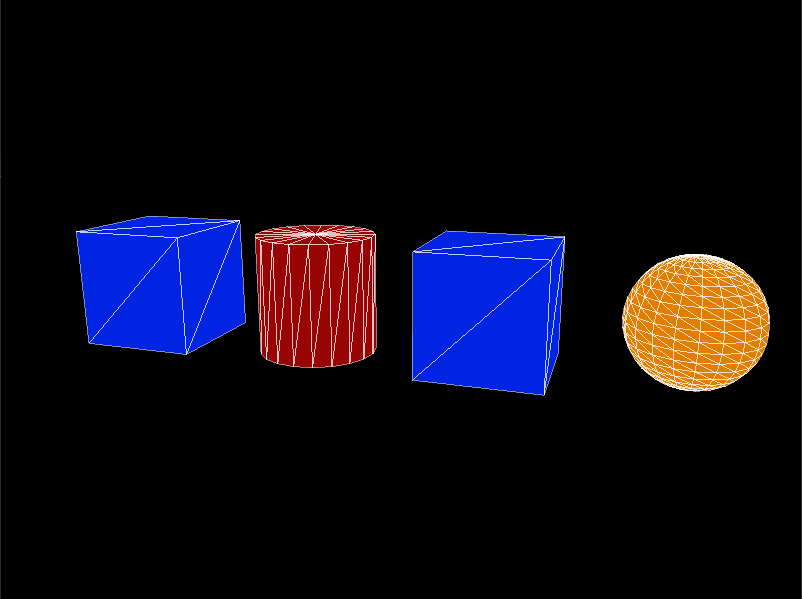

# GPU Driven Rendering

This example renders many objects using one indirect draw call.

The concept is taken from: https://vkguide.dev/docs/gpudriven/gpu_driven_engines/

## To run

```
cargo run --release --example gpu-driven-rendering
```

## Screenshots


