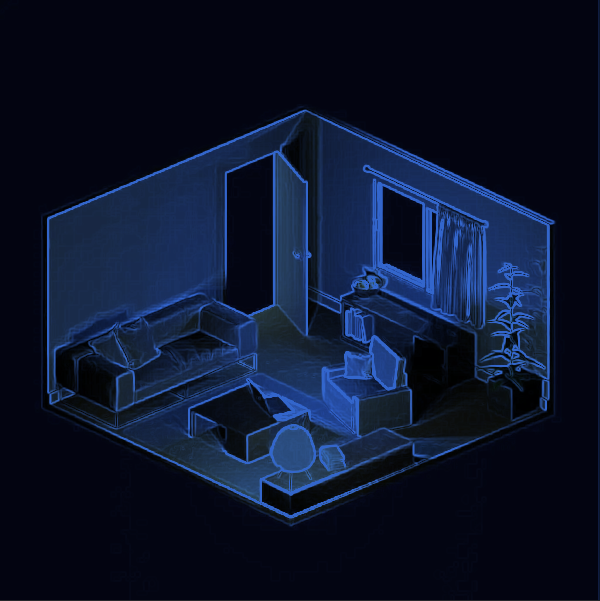

# Post processing

This example demonstrates a post-processing chain with two effects.

### Effects

 1. **Tint**
	- This effect multiplies the rendered image by a specified color, resulting in a *tinted* appearance.
 2. **Contour**
	- This effect uses the **Sobel operator** to perform edge detection, isolating the *contours* in the image.
	- Shader implementation is based on this code: https://gist.github.com/Hebali/6ebfc66106459aacee6a9fac029d0115

Both post-processing effects were inspired by an article on [Medium](https://medium.com/geekculture/shader-journey-3-basic-post-processing-effects-e9feb900ceff).

## To run

```
cargo run --release --example post-processing
```

## Screenshots

### Original scene


### After post-processing


